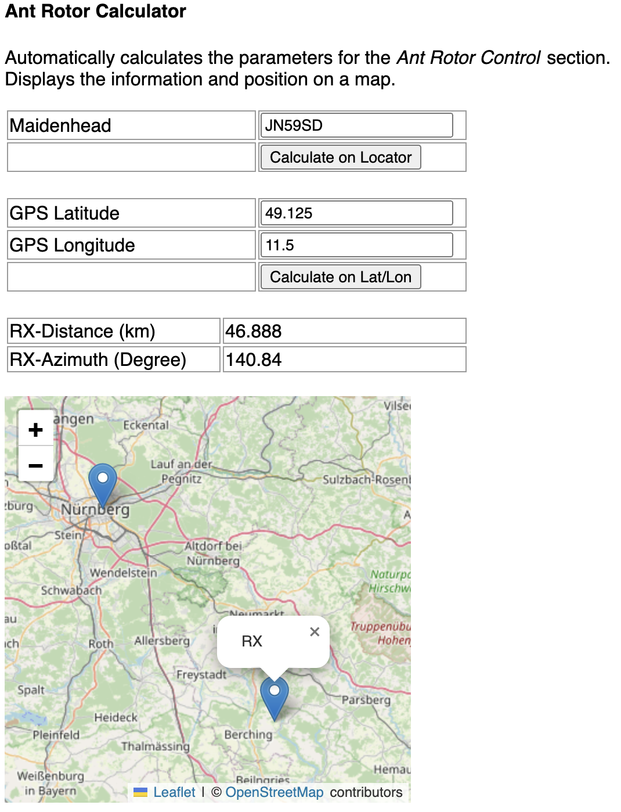

# RemoteRadioBeacon

An application to remotely rotate the antenna, set transmission parameters and transmit.

Tested on Kenwood TS-2000, HyGain DCU3, Raspberry Pi 4

## Features

- Control and display of antenna rotor parameters
- Control and display of parameters of a radio
- Calculate the antenna rotor parameters (azimuth and distance) based on GPS coordinates or the Maidenhead locator
- Web interface for remote control (flask)
- Multiple antenna rotors and radios supported (based on libhamlib-utils)
- Remote transmission of a wav file
- Https and authentication supported

## Preview

<table>
    <tr>
        <td></td>
        <td></td>
        <td></td>
    </tr>
</table>

## Config

- Edit `radioresources/config.json` to match your setup
- Add your own transmission file `radioresources/transmit.wav`

### Ant Rotator Services

- `DummyService` - Dummy service for testing
- `DCUService` - HyGain DCU3

### Radio Controller Services

- `DummyService` - Dummy service for testing
- `KenwoodService` - Kenwood TS-2000

## Install

### Development/Conda

- Run `conda create --name py311RemoteRadioBeacon python=3.11`
- Run `conda activate py311RemoteRadioBeacon`
- Run `pip install -r requirements.txt`

### Raspberry Pi 4

- `sudo apt-get install libhamlib-utils`
- `cd ..`
- `mkdir MBPythonEnv`
- `python -m venv MBPythonEnv/`
- `source MBPythonEnv/bin/activate`
- `cd RemoteRadioBeacon`
- `pip install -r requirements.txt`

## Start

### Development/Conda

- `conda activate py311RemoteRadioBeacon`
- `./start.sh`

### Raspberry Pi 4

- `cd ..`
- `source MBPythonEnv/bin/activate`
- `cd RemoteRadioBeacon`
- `./start.sh`
-

rigctl -m 2014 -s 38400 -r /dev/ttyUSB3 -P /dev/ttyUSB3 --set-conf=rts_state="OFF",dtr_state="OFF" get_freq
rigctl -m 2014 -s 38400 -r /dev/ttyUSB3 -P /dev/ttyUSB3 --set-conf=rts_state="OFF",dtr_state="OFF" set_freq 431030000

rigctl -m 2014 -s 38400 -r /dev/ttyUSB3 -P /dev/ttyUSB3 --set-conf=rts_state="OFF",dtr_state="OFF" get_mode
rigctl -m 2014 -s 38400 -r /dev/ttyUSB3 -P /dev/ttyUSB3 --set-conf=rts_state="OFF",dtr_state="OFF" set_mode USB 0

rigctl -m 2014 -s 38400 -r /dev/ttyUSB3 -P /dev/ttyUSB3 --set-conf=rts_state="OFF",dtr_state="OFF" get_level RFPOWER
rigctl -m 2014 -s 38400 -r /dev/ttyUSB3 -P /dev/ttyUSB3 --set-conf=rts_state="OFF",dtr_state="OFF" set_level RFPOWER 0.1

rigctl -m 2014 -s 38400 -r /dev/ttyUSB3 -P /dev/ttyUSB3 --set-conf=rts_state="OFF",dtr_state="OFF" T 0
rigctl -m 2014 -s 38400 -r /dev/ttyUSB3 -P /dev/ttyUSB3 --set-conf=rts_state="ON",dtr_state="ON" T 1