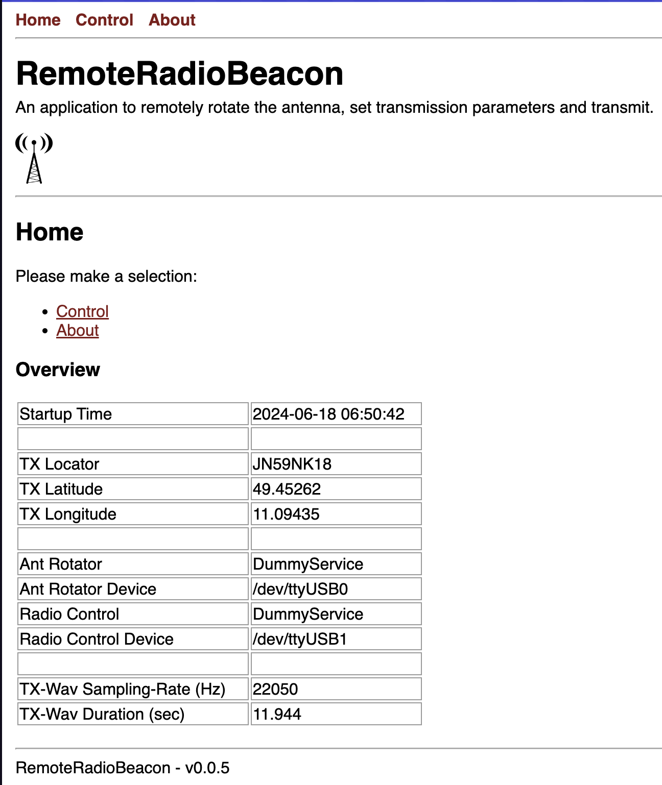
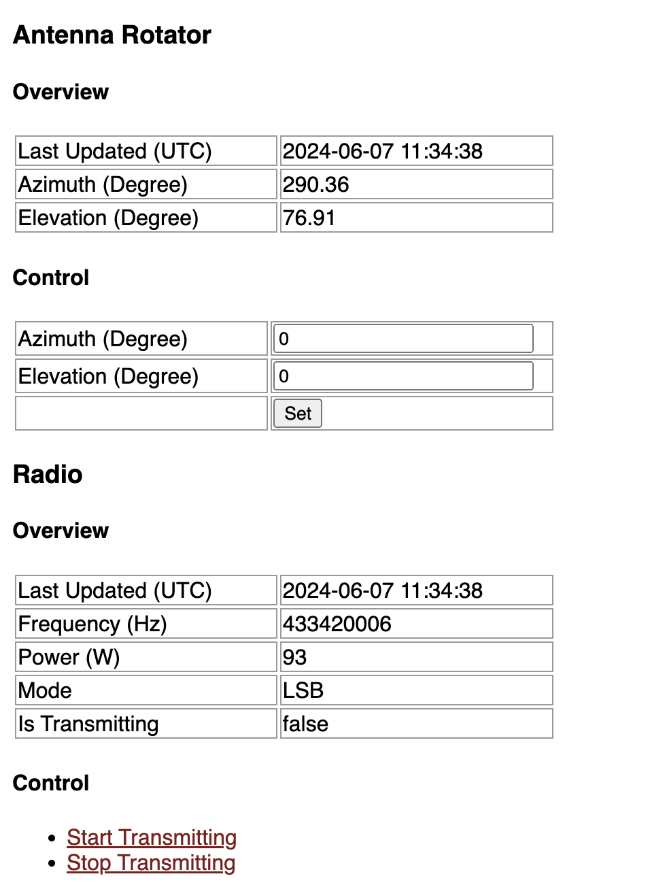

# RemoteBeacon

An application to remotely rotate the antenna, set transmission parameters and transmit.

Tested on ...

## Preview

<table>
    <tr>
        <td></td>
        <td></td>
    </tr>
</table>

## Installation

- Run `conda create --name py311RemoteBeacon python=3.11`
- Run `conda activate py311RemoteBeacon`
- Run `pip install -r requirements.txt`
- Edit `config.json` to match your setup
- Add your own transmission file `transmit.wav`

## Start

- `conda activate py311RemoteBeacon`
- `./start.sh`